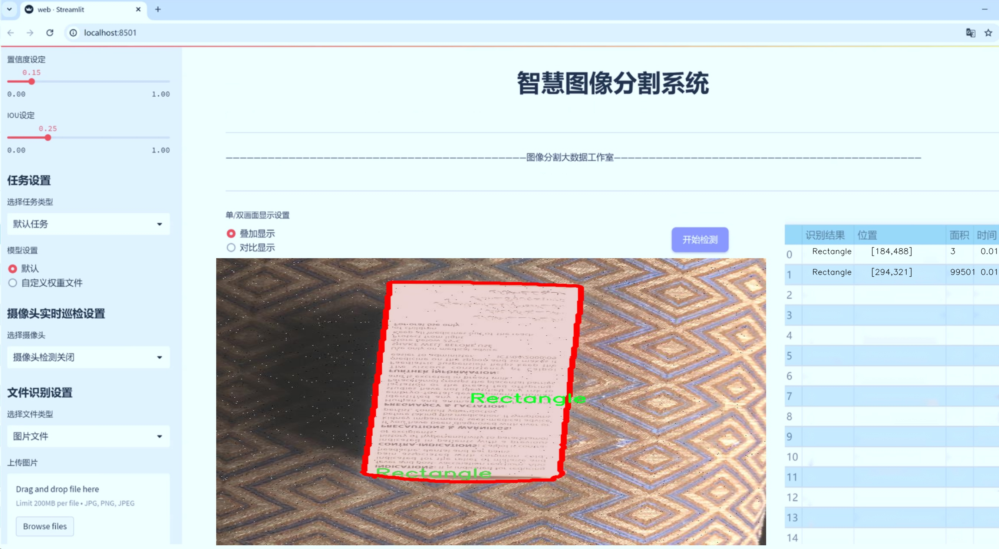
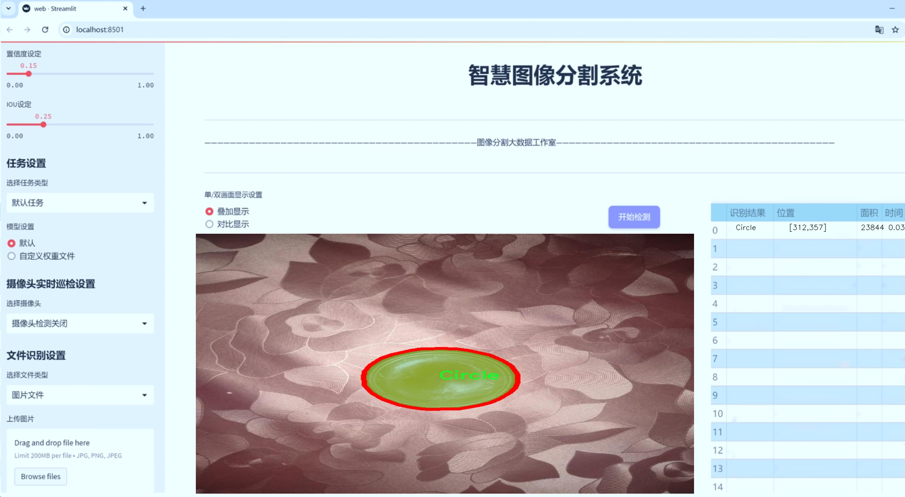
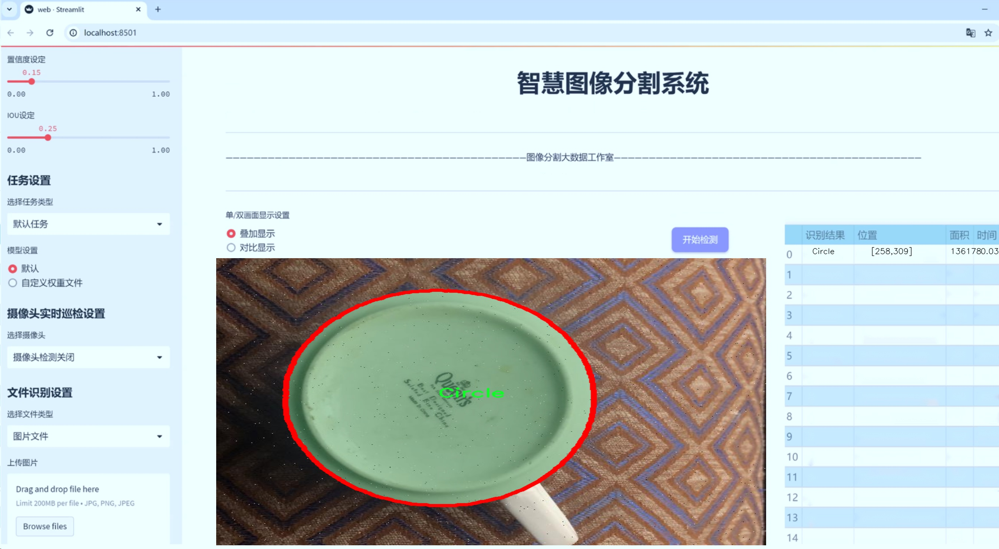
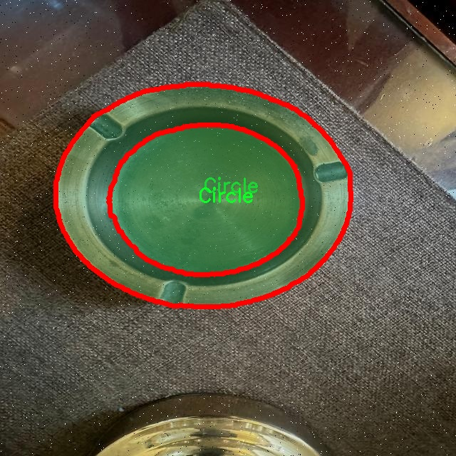
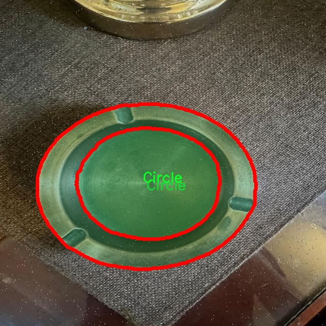
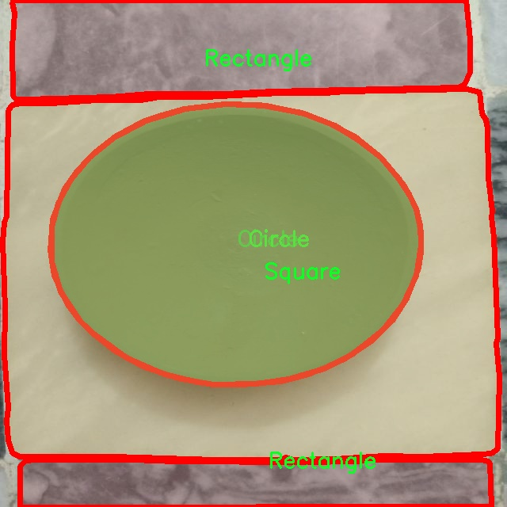
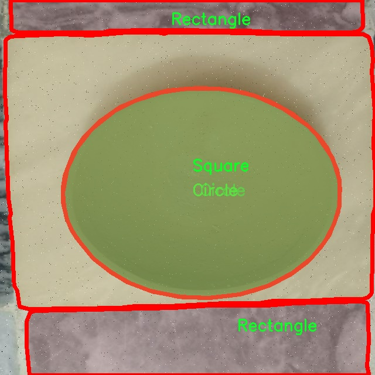

# 几何形状分割系统源码＆数据集分享
 [yolov8-seg-C2f-DCNV2＆yolov8-seg-LAWDS等50+全套改进创新点发刊_一键训练教程_Web前端展示]

### 1.研究背景与意义

项目参考[ILSVRC ImageNet Large Scale Visual Recognition Challenge](https://gitee.com/YOLOv8_YOLOv11_Segmentation_Studio/projects)

项目来源[AAAI Global Al lnnovation Contest](https://kdocs.cn/l/cszuIiCKVNis)

研究背景与意义

随着计算机视觉技术的快速发展，物体检测与分割在多个领域中得到了广泛应用，包括自动驾驶、智能监控、医疗影像分析等。其中，几何形状的识别与分割作为基础的视觉任务之一，具有重要的理论价值和实际意义。几何形状不仅是物体的基本构成元素，而且在许多应用场景中，形状的准确识别与分割直接影响到后续的处理和分析效果。因此，研究基于改进YOLOv8的几何形状分割系统，具有重要的学术和应用价值。

YOLO（You Only Look Once）系列模型因其高效的实时检测能力而受到广泛关注。YOLOv8作为该系列的最新版本，结合了深度学习的最新进展，具有更强的特征提取能力和更高的检测精度。然而，传统的YOLO模型在处理复杂背景和多样化形状时，可能面临形状分割不准确的问题。因此，针对YOLOv8进行改进，以提高其在几何形状分割任务中的表现，具有重要的研究意义。

本研究所使用的数据集包含1700张图像，涵盖了三种基本几何形状：圆形、矩形和正方形。这些形状在许多实际应用中具有普遍性，且相对简单，适合用于初步的形状检测与分割研究。通过对这些几何形状的实例分割，不仅可以验证改进YOLOv8模型的有效性，还可以为后续更复杂形状的分割奠定基础。此外，数据集中每种形状的数量相对均衡，有助于模型的训练与评估，避免了因数据不均衡导致的偏差。

在理论层面，几何形状的分割研究有助于深化我们对物体识别与分割技术的理解。通过对YOLOv8模型的改进，可以探索新的特征提取方法、损失函数设计及网络结构优化等，推动深度学习在图像分割领域的进一步发展。同时，研究结果也将为其他形状或物体的分割任务提供参考，促进相关领域的交叉研究。

在实际应用层面，改进的YOLOv8几何形状分割系统可以广泛应用于工业检测、机器人视觉、图像检索等领域。例如，在工业生产中，自动化检测系统可以通过对几何形状的快速识别与分割，提高产品质量控制的效率；在机器人视觉中，精确的形状分割可以帮助机器人更好地理解环境，从而实现更智能的交互与操作。因此，本研究不仅具有重要的学术价值，还具备广泛的应用前景。

综上所述，基于改进YOLOv8的几何形状分割系统的研究，不仅能够推动计算机视觉领域的技术进步，还能为实际应用提供有效的解决方案，具有重要的研究背景与深远的意义。

### 2.图片演示







##### 注意：由于此博客编辑较早，上面“2.图片演示”和“3.视频演示”展示的系统图片或者视频可能为老版本，新版本在老版本的基础上升级如下：（实际效果以升级的新版本为准）

  （1）适配了YOLOV8的“目标检测”模型和“实例分割”模型，通过加载相应的权重（.pt）文件即可自适应加载模型。

  （2）支持“图片识别”、“视频识别”、“摄像头实时识别”三种识别模式。

  （3）支持“图片识别”、“视频识别”、“摄像头实时识别”三种识别结果保存导出，解决手动导出（容易卡顿出现爆内存）存在的问题，识别完自动保存结果并导出到tempDir中。

  （4）支持Web前端系统中的标题、背景图等自定义修改，后面提供修改教程。

  另外本项目提供训练的数据集和训练教程,暂不提供权重文件（best.pt）,需要您按照教程进行训练后实现图片演示和Web前端界面演示的效果。

### 3.视频演示

[3.1 视频演示](https://www.bilibili.com/video/BV1wRCmY9EBB/)

### 4.数据集信息展示

##### 4.1 本项目数据集详细数据（类别数＆类别名）

nc: 3
names: ['Circle', 'Rectangle', 'Square']


##### 4.2 本项目数据集信息介绍

数据集信息展示

在本研究中，我们使用了名为“Shape_Detection”的数据集，以支持对YOLOv8-seg几何形状分割系统的改进与训练。该数据集专注于三种基本几何形状的检测与分割，具体包括圆形、矩形和正方形。数据集的类别数量为三，分别为“Circle”、“Rectangle”和“Square”。这些形状不仅在计算机视觉领域中具有广泛的应用，也为深度学习模型的训练提供了丰富的特征和挑战。

“Shape_Detection”数据集的构建考虑到了多样性和复杂性，以确保模型在实际应用中的鲁棒性。每个类别的样本均经过精心挑选，涵盖了不同的尺寸、颜色和背景，以模拟真实世界中可能遇到的各种情况。例如，圆形样本可能包括不同直径的圆，矩形样本则可能涉及不同长宽比的矩形，而正方形样本则会在不同的背景下呈现出多样的视觉效果。这种多样性不仅有助于模型学习到更具代表性的特征，也提高了其在实际应用中的适应能力。

在数据集的标注过程中，我们采用了高精度的标注工具，确保每个几何形状的边界框和分割掩码的准确性。这一过程对于训练深度学习模型至关重要，因为准确的标注直接影响到模型的学习效果和最终的分割性能。数据集中的每个样本都附带了详细的标注信息，包括形状的类别、位置以及对应的掩码。这些信息为YOLOv8-seg模型提供了必要的监督信号，使其能够在训练过程中有效地学习到不同几何形状的特征。

此外，为了增强模型的泛化能力，我们还对数据集进行了数据增强处理。通过旋转、缩放、平移和颜色变换等手段，我们生成了多样化的训练样本。这一策略不仅增加了数据集的规模，也使得模型能够在面对不同的输入时表现得更加稳健。通过这些增强手段，模型在学习过程中能够更好地理解几何形状的变换特性，从而提高其在实际应用中的表现。

“Shape_Detection”数据集的设计和构建充分考虑了几何形状分割任务的需求，为YOLOv8-seg模型的训练提供了坚实的基础。通过对该数据集的深入分析和利用，我们期望能够显著提升模型在几何形状分割任务中的性能，使其在各种实际应用场景中表现出色。无论是在工业检测、自动驾驶还是机器人视觉等领域，准确的几何形状分割都将为系统的智能化提供重要支持。因此，充分利用“Shape_Detection”数据集，将为推动几何形状分割技术的发展做出积极贡献。










### 5.全套项目环境部署视频教程（零基础手把手教学）

[5.1 环境部署教程链接（零基础手把手教学）](https://www.bilibili.com/video/BV1jG4Ve4E9t/?vd_source=bc9aec86d164b67a7004b996143742dc)


[5.2 安装Python虚拟环境创建和依赖库安装视频教程链接（零基础手把手教学）](https://www.bilibili.com/video/BV1nA4VeYEze/?vd_source=bc9aec86d164b67a7004b996143742dc)

### 6.手把手YOLOV8-seg训练视频教程（零基础小白有手就能学会）

[6.1 手把手YOLOV8-seg训练视频教程（零基础小白有手就能学会）](https://www.bilibili.com/video/BV1cA4VeYETe/?vd_source=bc9aec86d164b67a7004b996143742dc)


按照上面的训练视频教程链接加载项目提供的数据集，运行train.py即可开始训练



     Epoch   gpu_mem       box       obj       cls    labels  img_size
     1/200     0G   0.01576   0.01955  0.007536        22      1280: 100%|██████████| 849/849 [14:42<00:00,  1.04s/it]
               Class     Images     Labels          P          R     mAP@.5 mAP@.5:.95: 100%|██████████| 213/213 [01:14<00:00,  2.87it/s]
                 all       3395      17314      0.994      0.957      0.0957      0.0843

     Epoch   gpu_mem       box       obj       cls    labels  img_size
     2/200     0G   0.01578   0.01923  0.007006        22      1280: 100%|██████████| 849/849 [14:44<00:00,  1.04s/it]
               Class     Images     Labels          P          R     mAP@.5 mAP@.5:.95: 100%|██████████| 213/213 [01:12<00:00,  2.95it/s]
                 all       3395      17314      0.996      0.956      0.0957      0.0845

     Epoch   gpu_mem       box       obj       cls    labels  img_size
     3/200     0G   0.01561    0.0191  0.006895        27      1280: 100%|██████████| 849/849 [10:56<00:00,  1.29it/s]
               Class     Images     Labels          P          R     mAP@.5 mAP@.5:.95: 100%|███████   | 187/213 [00:52<00:00,  4.04it/s]
                 all       3395      17314      0.996      0.957      0.0957      0.0845


### 7.50+种全套YOLOV8-seg创新点代码加载调参视频教程（一键加载写好的改进模型的配置文件）

[7.1 50+种全套YOLOV8-seg创新点代码加载调参视频教程（一键加载写好的改进模型的配置文件）](https://www.bilibili.com/video/BV1Hw4VePEXv/?vd_source=bc9aec86d164b67a7004b996143742dc)

### 8.YOLOV8-seg图像分割算法原理

原始YOLOv8-seg算法原理

YOLOv8-seg是Ultralytics公司在2023年1月发布的最新目标检测与分割算法，它在YOLO系列的基础上进行了深度优化和创新，尤其是在目标检测的精度和速度方面达到了新的高度。作为YOLOv8的一个重要扩展，YOLOv8-seg不仅具备目标检测的能力，还能够实现精确的实例分割，这使得它在复杂场景下的应用潜力更为广泛。YOLOv8-seg的设计理念在于通过改进的卷积神经网络结构和先进的特征融合技术，实现对图像中多个目标的高效检测与分割。

YOLOv8-seg的网络架构依然遵循YOLO系列的传统，采用了输入层、主干网络、特征融合层和解耦头的设计。主干网络部分，YOLOv8-seg引入了C2f模块，替代了YOLOv5中的C3模块。C2f模块通过引入ELAN（Efficient Layer Aggregation Network）思想，增强了特征的重用能力，并有效缓解了深层网络中的梯度消失问题。该模块由多个卷积块（CBS）和Bottleneck结构组成，能够在保持模型轻量化的同时，提升特征提取的效率和准确性。

在特征融合层，YOLOv8-seg采用了PAN-FPN（Path Aggregation Network with Feature Pyramid Network）结构。这一结构通过自下而上的特征融合和自上而下的特征传递，有效地整合了不同层次的特征信息。具体而言，浅层特征提供了丰富的细节信息，而高层特征则提供了更为抽象的语义信息。通过这种深度融合，YOLOv8-seg能够在不同尺度上对目标进行精确的检测与分割。

YOLOv8-seg的解耦头部分采用了Anchor-Free的设计理念，摒弃了传统的Anchor-Base方法。这一创新使得模型在处理不同大小和形状的目标时，能够更加灵活和高效。解耦头将分类和回归任务分开处理，分别输出目标的类别和边界框信息。这种设计不仅简化了模型的结构，还提高了检测的精度和速度。

在损失函数方面，YOLOv8-seg引入了VFLLoss和DFLLoss+CIoULoss等新型损失函数，以更好地处理分类和回归任务中的不平衡问题。VFLLoss在处理类别不平衡时表现出色，能够有效提升模型对难以分类样本的关注度。而DFLLoss和CIoULoss则在边界框回归中提供了更为精确的优化，确保了检测结果的准确性。

数据预处理方面，YOLOv8-seg依然沿用了YOLOv5的策略，采用了多种数据增强技术，如马赛克增强、混合增强、空间扰动和颜色扰动等。这些增强手段在训练过程中有效提高了模型的鲁棒性，使其能够在多样化的场景中保持良好的性能。

在具体应用中，YOLOv8-seg展现出了强大的目标检测与分割能力。例如，在智能监控、自动驾驶和医疗影像分析等领域，YOLOv8-seg能够实时识别和分割出目标物体，提供精确的位置信息和类别标签。这种高效的检测与分割能力，使得YOLOv8-seg成为了现代计算机视觉任务中的一个重要工具。

总的来说，YOLOv8-seg通过对YOLO系列算法的不断优化与创新，结合深度学习领域的最新研究成果，成功实现了目标检测与分割的高效融合。其独特的网络结构设计、先进的特征融合技术以及高效的损失函数，使得YOLOv8-seg在处理复杂场景中的目标检测与分割任务时，展现出了卓越的性能。这一算法的推出，无疑为计算机视觉领域带来了新的发展机遇，推动了智能应用的进一步普及与发展。


### 9.系统功能展示（检测对象为举例，实际内容以本项目数据集为准）

图9.1.系统支持检测结果表格显示

  图9.2.系统支持置信度和IOU阈值手动调节

  图9.3.系统支持自定义加载权重文件best.pt(需要你通过步骤5中训练获得)

  图9.4.系统支持摄像头实时识别

  图9.5.系统支持图片识别

  图9.6.系统支持视频识别

  图9.7.系统支持识别结果文件自动保存

  图9.8.系统支持Excel导出检测结果数据


### 10.50+种全套YOLOV8-seg创新点原理讲解（非科班也可以轻松写刊发刊，V11版本正在科研待更新）

#### 10.1 由于篇幅限制，每个创新点的具体原理讲解就不一一展开，具体见下列网址中的创新点对应子项目的技术原理博客网址【Blog】：


[10.1 50+种全套YOLOV8-seg创新点原理讲解链接](https://gitee.com/qunmasj/good)

#### 10.2 部分改进模块原理讲解(完整的改进原理见上图和技术博客链接)【如果此小节的图加载失败可以通过CSDN或者Github搜索该博客的标题访问原始博客，原始博客图片显示正常】
### FasterNet简介
神经网络在图像分类、检测和分割等各种计算机视觉任务中经历了快速发展。尽管其令人印象深刻的性能为许多应用程序提供了动力，但一个巨大的趋势是追求具有低延迟和高吞吐量的快速神经网络，以获得良好的用户体验、即时响应和安全原因等。

如何快速？研究人员和从业者不需要更昂贵的计算设备，而是倾向于设计具有成本效益的快速神经网络，降低计算复杂度，主要以浮点运算（FLOPs）的数量来衡量。

MobileNet、ShuffleNet和GhostNet等利用深度卷积（DWConv）和/或组卷积（GConv）来提取空间特征。然而，在减少FLOPs的过程中，算子经常会受到内存访问增加的副作用的影响。MicroNet进一步分解和稀疏网络，将其FLOPs推至极低水平。尽管这种方法在FLOPs方面有所改进，但其碎片计算效率很低。此外，上述网络通常伴随着额外的数据操作，如级联、Shuffle和池化，这些操作的运行时间对于小型模型来说往往很重要。

除了上述纯卷积神经网络（CNNs）之外，人们对使视觉Transformer（ViTs）和多层感知器（MLP）架构更小更快也越来越感兴趣。例如，MobileViT和MobileFormer通过将DWConv与改进的注意力机制相结合，降低了计算复杂性。然而，它们仍然受到DWConv的上述问题的困扰，并且还需要修改的注意力机制的专用硬件支持。使用先进但耗时的标准化和激活层也可能限制其在设备上的速度。

所有这些问题一起导致了以下问题：这些“快速”的神经网络真的很快吗？为了回答这个问题，作者检查了延迟和FLOPs之间的关系，这由


其中FLOPS是每秒浮点运算的缩写，作为有效计算速度的度量。虽然有许多减少FLOPs的尝试，但都很少考虑同时优化FLOPs以实现真正的低延迟。为了更好地理解这种情况，作者比较了Intel CPU上典型神经网络的FLOPS。


图中的结果表明，许多现有神经网络的FLOPS较低，其FLOPS通常低于流行的ResNet50。由于FLOPS如此之低，这些“快速”的神经网络实际上不够快。它们的FLOPs减少不能转化为延迟的确切减少量。在某些情况下，没有任何改善，甚至会导致更糟的延迟。例如，CycleMLP-B1具有ResNet50的一半FLOPs，但运行速度较慢（即CycleMLPB1与ResNet50:111.9ms与69.4ms）。

请注意，FLOPs与延迟之间的差异在之前的工作中也已被注意到，但由于它们采用了DWConv/GConv和具有低FLOPs的各种数据处理，因此部分问题仍未解决。人们认为没有更好的选择。

该博客提供的方案通过开发一种简单、快速、有效的运算符来消除这种差异，该运算符可以在减少FLOPs的情况下保持高FLOPS。

具体来说，作者重新审视了现有的操作符，特别是DWConv的计算速度——FLOPS。作者发现导致低FLOPS问题的主要原因是频繁的内存访问。然后，作者提出了PConv作为一种竞争性替代方案，它减少了计算冗余以及内存访问的数量。

图1说明了PConv的设计。它利用了特征图中的冗余，并系统地仅在一部分输入通道上应用规则卷积（Conv），而不影响其余通道。本质上，PConv的FLOPs低于常规Conv，而FLOPs高于DWConv/GConv。换句话说，PConv更好地利用了设备上的计算能力。PConv在提取空间特征方面也很有效，这在本文后面的实验中得到了验证。

作者进一步引入PConv设计了FasterNet作为一个在各种设备上运行速度非常快的新网络家族。特别是，FasterNet在分类、检测和分割任务方面实现了最先进的性能，同时具有更低的延迟和更高的吞吐量。例如，在GPU、CPU和ARM处理器上，小模型FasterNet-T0分别比MobileVitXXS快3.1倍、3.1倍和2.5倍，而在ImageNet-1k上的准确率高2.9%。大模型FasterNet-L实现了83.5%的Top-1精度，与Swin-B不相上下，同时在GPU上提供了49%的高吞吐量，在CPU上节省了42%的计算时间。

总之，贡献如下：

指出了实现更高FLOPS的重要性，而不仅仅是为了更快的神经网络而减少FLOPs。

引入了一种简单但快速且有效的卷积PConv，它很有可能取代现有的选择DWConv。

推出FasterNet，它在GPU、CPU和ARM处理器等多种设备上运行良好且普遍快速。

对各种任务进行了广泛的实验，并验证了PConv和FasterNet的高速性和有效性。

### Conv和FasterNet的设计
#### 原理

DWConv是Conv的一种流行变体，已被广泛用作许多神经网络的关键构建块。对于输入，DWConv应用个滤波器来计算输出。如图（b）所示，每个滤波器在一个输入通道上进行空间滑动，并对一个输出通道做出贡献。

与具有的FLOPs常规Conv相比，这种深度计算使得DWConv仅仅具有的FLOPs。虽然在减少FLOPs方面有效，但DWConv（通常后跟逐点卷积或PWConv）不能简单地用于替换常规Conv，因为它会导致严重的精度下降。因此，在实践中，DWConv的通道数（或网络宽度）增加到＞以补偿精度下降，例如，倒置残差块中的DWConv宽度扩展了6倍。然而，这会导致更高的内存访问，这会造成不可忽略的延迟，并降低总体计算速度，尤其是对于I/O绑定设备。特别是，内存访问的数量现在上升到


它比一个常规的Conv的值要高，即，


注意，内存访问花费在I/O操作上，这被认为已经是最小的成本，很难进一步优化。

#### PConv作为一个基本的算子


在下面演示了通过利用特征图的冗余度可以进一步优化成本。如图所示，特征图在不同通道之间具有高度相似性。许多其他著作也涵盖了这种冗余，但很少有人以简单而有效的方式充分利用它。


具体而言，作者提出了一种简单的PConv，以同时减少计算冗余和内存访问。图4中的左下角说明了PConv的工作原理。它只需在输入通道的一部分上应用常规Conv进行空间特征提取，并保持其余通道不变。对于连续或规则的内存访问，将第一个或最后一个连续的通道视为整个特征图的代表进行计算。在不丧失一般性的情况下认为输入和输出特征图具有相同数量的通道。因此，PConv的FLOPs仅


对于典型的r＝1/4 ，PConv的FLOPs只有常规Conv的1/16。此外，PConv的内存访问量较小，即：


对于r＝1/4，其仅为常规Conv的1/4。

由于只有通道用于空间特征提取，人们可能会问是否可以简单地移除剩余的（c−）通道？如果是这样，PConv将退化为具有较少通道的常规Conv，这偏离了减少冗余的目标。

请注意，保持其余通道不变，而不是从特征图中删除它们。这是因为它们对后续PWConv层有用，PWConv允许特征信息流经所有通道。

#### PConv之后是PWConv


为了充分有效地利用来自所有通道的信息，进一步将逐点卷积（PWConv）附加到PConv。它们在输入特征图上的有效感受野看起来像一个T形Conv，与均匀处理补丁的常规Conv相比，它更专注于中心位置，如图5所示。为了证明这个T形感受野的合理性，首先通过计算位置的Frobenius范数来评估每个位置的重要性。


假设，如果一个职位比其他职位具有更大的Frobenius范数，则该职位往往更重要。对于正则Conv滤波器，位置处的Frobenius范数由计算，其中。


一个显著位置是具有最大Frobenius范数的位置。然后，在预训练的ResNet18中集体检查每个过滤器，找出它们的显著位置，并绘制显著位置的直方图。图6中的结果表明，中心位置是过滤器中最常见的突出位置。换句话说，中心位置的权重比周围的更重。这与集中于中心位置的T形计算一致。

虽然T形卷积可以直接用于高效计算，但作者表明，将T形卷积分解为PConv和PWConv更好，因为该分解利用了滤波器间冗余并进一步节省了FLOPs。对于相同的输入和输出，T形Conv的FLOPs可以计算为:


它高于PConv和PWConv的流量，即：


其中和（例如，当时）。此外，可以很容易地利用常规Conv进行两步实现。

# FasterNet作为Backbone
鉴于新型PConv和现成的PWConv作为主要的算子，进一步提出FasterNet，这是一个新的神经网络家族，运行速度非常快，对许多视觉任务非常有效。目标是使体系结构尽可能简单，使其总体上对硬件友好。


在图中展示了整体架构。它有4个层次级，每个层次级前面都有一个嵌入层（步长为4的常规4×4卷积）或一个合并层（步长为2的常规2×2卷积），用于空间下采样和通道数量扩展。每个阶段都有一堆FasterNet块。作者观察到，最后两个阶段中的块消耗更少的内存访问，并且倾向于具有更高的FLOPS，如表1中的经验验证。因此，放置了更多FasterNet块，并相应地将更多计算分配给最后两个阶段。每个FasterNet块有一个PConv层，后跟2个PWConv（或Conv 1×1）层。它们一起显示为倒置残差块，其中中间层具有扩展的通道数量，并且放置了Shorcut以重用输入特征。

除了上述算子，标准化和激活层对于高性能神经网络也是不可或缺的。然而，许多先前的工作在整个网络中过度使用这些层，这可能会限制特征多样性，从而损害性能。它还可以降低整体计算速度。相比之下，只将它们放在每个中间PWConv之后，以保持特征多样性并实现较低的延迟。

此外，使用批次归一化（BN）代替其他替代方法。BN的优点是，它可以合并到其相邻的Conv层中，以便更快地进行推断，同时与其他层一样有效。对于激活层，根据经验选择了GELU用于较小的FasterNet变体，而ReLU用于较大的FasterNet变体，同时考虑了运行时间和有效性。最后三个层，即全局平均池化、卷积1×1和全连接层，一起用于特征转换和分类。

为了在不同的计算预算下提供广泛的应用，提供FasterNet的Tiny模型、Small模型、Medium模型和Big模型变体，分别称为FasterNetT0/1/2、FasterNet-S、FasterNet-M和FasterNet-L。它们具有相似的结构，但深度和宽度不同。

架构规范如下：


### 11.项目核心源码讲解（再也不用担心看不懂代码逻辑）

#### 11.1 ultralytics\utils\callbacks\wb.py

以下是经过精简和注释的核心代码部分，主要保留了与WandB（Weights and Biases）集成相关的功能，以便于监控和记录模型训练过程中的指标和可视化效果。

```python
# 导入必要的库
from ultralytics.utils import SETTINGS, TESTS_RUNNING
from ultralytics.utils.torch_utils import model_info_for_loggers

try:
    # 确保不是在测试环境中
    assert not TESTS_RUNNING  
    # 确保WandB集成已启用
    assert SETTINGS['wandb'] is True  
    import wandb as wb
    assert hasattr(wb, '__version__')  # 确保WandB包已正确导入
    import numpy as np
    import pandas as pd

    _processed_plots = {}  # 用于记录已处理的图表

except (ImportError, AssertionError):
    wb = None  # 如果导入失败，设置wb为None


def _custom_table(x, y, classes, title='Precision Recall Curve', x_title='Recall', y_title='Precision'):
    """
    创建并记录自定义的精确度-召回率曲线可视化。

    Args:
        x (List): x轴的值，长度为N。
        y (List): y轴的值，长度为N。
        classes (List): 每个点的类别标签，长度为N。
        title (str, optional): 图表标题，默认为'Precision Recall Curve'。
        x_title (str, optional): x轴标签，默认为'Recall'。
        y_title (str, optional): y轴标签，默认为'Precision'。

    Returns:
        (wandb.Object): 适合记录的WandB对象，展示自定义的指标可视化。
    """
    df = pd.DataFrame({'class': classes, 'y': y, 'x': x}).round(3)  # 创建数据框
    fields = {'x': 'x', 'y': 'y', 'class': 'class'}
    string_fields = {'title': title, 'x-axis-title': x_title, 'y-axis-title': y_title}
    return wb.plot_table('wandb/area-under-curve/v0',
                         wb.Table(dataframe=df),
                         fields=fields,
                         string_fields=string_fields)


def _plot_curve(x, y, names=None, id='precision-recall', title='Precision Recall Curve', x_title='Recall', y_title='Precision', num_x=100, only_mean=False):
    """
    记录指标曲线可视化。

    Args:
        x (np.ndarray): x轴数据点，长度为N。
        y (np.ndarray): y轴数据点，形状为CxN，C为类别数。
        names (list, optional): y轴数据对应的类别名称，长度为C。
        id (str, optional): 在WandB中记录数据的唯一标识符，默认为'precision-recall'。
        title (str, optional): 可视化图表的标题，默认为'Precision Recall Curve'。
        x_title (str, optional): x轴标签，默认为'Recall'。
        y_title (str, optional): y轴标签，默认为'Precision'。
        num_x (int, optional): 可视化的插值数据点数量，默认为100。
        only_mean (bool, optional): 指示是否仅绘制均值曲线的标志，默认为True。
    """
    if names is None:
        names = []  # 如果没有提供类别名称，则初始化为空列表
    x_new = np.linspace(x[0], x[-1], num_x).round(5)  # 创建新的x值

    # 创建用于记录的数组
    x_log = x_new.tolist()
    y_log = np.interp(x_new, x, np.mean(y, axis=0)).round(3).tolist()  # 插值计算y值

    if only_mean:
        # 仅记录均值曲线
        table = wb.Table(data=list(zip(x_log, y_log)), columns=[x_title, y_title])
        wb.run.log({title: wb.plot.line(table, x_title, y_title, title=title)})
    else:
        # 记录每个类别的曲线
        classes = ['mean'] * len(x_log)
        for i, yi in enumerate(y):
            x_log.extend(x_new)  # 添加新的x值
            y_log.extend(np.interp(x_new, x, yi))  # 对y进行插值
            classes.extend([names[i]] * len(x_new))  # 添加类别名称
        wb.log({id: _custom_table(x_log, y_log, classes, title, x_title, y_title)}, commit=False)


def on_fit_epoch_end(trainer):
    """在每个训练周期结束时记录训练指标和模型信息。"""
    wb.run.log(trainer.metrics, step=trainer.epoch + 1)  # 记录当前周期的指标
    # 记录图表
    _log_plots(trainer.plots, step=trainer.epoch + 1)
    _log_plots(trainer.validator.plots, step=trainer.epoch + 1)
    if trainer.epoch == 0:
        wb.run.log(model_info_for_loggers(trainer), step=trainer.epoch + 1)  # 记录模型信息


def on_train_end(trainer):
    """在训练结束时保存最佳模型作为artifact。"""
    _log_plots(trainer.validator.plots, step=trainer.epoch + 1)
    _log_plots(trainer.plots, step=trainer.epoch + 1)
    art = wb.Artifact(type='model', name=f'run_{wb.run.id}_model')  # 创建模型artifact
    if trainer.best.exists():
        art.add_file(trainer.best)  # 添加最佳模型文件
        wb.run.log_artifact(art, aliases=['best'])  # 记录artifact
    # 记录验证指标曲线
    for curve_name, curve_values in zip(trainer.validator.metrics.curves, trainer.validator.metrics.curves_results):
        x, y, x_title, y_title = curve_values
        _plot_curve(
            x,
            y,
            names=list(trainer.validator.metrics.names.values()),
            id=f'curves/{curve_name}',
            title=curve_name,
            x_title=x_title,
            y_title=y_title,
        )
    wb.run.finish()  # 结束WandB运行


# 定义回调函数
callbacks = {
    'on_fit_epoch_end': on_fit_epoch_end,
    'on_train_end': on_train_end
} if wb else {}
```

### 代码说明：
1. **导入部分**：导入必要的库，包括WandB、NumPy和Pandas。
2. **异常处理**：在导入WandB时进行异常处理，确保环境配置正确。
3. **_custom_table**：创建自定义的精确度-召回率曲线表格，并记录到WandB。
4. **_plot_curve**：根据输入数据生成并记录指标曲线，支持均值和单类曲线的绘制。
5. **on_fit_epoch_end**：在每个训练周期结束时记录训练指标和模型信息。
6. **on_train_end**：在训练结束时保存最佳模型并记录验证指标曲线。

以上代码片段提供了模型训练过程中的重要监控和记录功能，便于后续分析和可视化。

这个文件 `ultralytics/utils/callbacks/wb.py` 是一个用于集成 Weights & Biases（wandb）工具的回调模块，主要用于在训练深度学习模型时记录和可视化训练过程中的各种指标和图表。文件的开头导入了一些必要的库和模块，并进行了基本的检查，以确保在非测试环境下运行并且 wandb 集成已启用。

首先，文件尝试导入 wandb 库，并确保其版本有效。如果导入失败或设置不正确，则将 `wb` 变量设置为 `None`，以避免后续代码出错。

接下来，定义了几个辅助函数：

1. `_custom_table` 函数用于创建和记录一个自定义的精确度-召回曲线（Precision-Recall Curve）可视化。它接受 x 和 y 轴的数据点、类别标签以及图表的标题等参数，并返回一个适合记录的 wandb 对象。

2. `_plot_curve` 函数用于生成并记录一个指标曲线的可视化。它根据输入的数据生成曲线，并可以选择只记录平均曲线或每个类别的曲线。该函数利用 `_custom_table` 函数来生成实际的可视化内容。

3. `_log_plots` 函数用于记录输入字典中的图表，如果在指定的步骤中尚未记录过这些图表，则将其记录下来。

接下来的几个函数是训练过程中的回调函数：

- `on_pretrain_routine_start` 函数在预训练例程开始时被调用，用于初始化 wandb 项目。

- `on_fit_epoch_end` 函数在每个训练周期结束时被调用，记录训练指标和模型信息。

- `on_train_epoch_end` 函数在每个训练周期结束时被调用，记录训练损失和学习率，并在特定条件下记录图表。

- `on_train_end` 函数在训练结束时被调用，记录验证图表和训练图表，并将最佳模型保存为一个 artifact。它还会记录验证指标的曲线，并在最后结束 wandb 运行。

最后，文件定义了一个 `callbacks` 字典，将这些回调函数与相应的事件关联起来，只有在 wandb 可用时才会创建这个字典。这个结构使得在训练过程中可以灵活地记录和可视化各种指标，帮助用户更好地理解模型的性能和训练过程。

#### 11.2 ultralytics\nn\extra_modules\block.py

以下是代码中最核心的部分，并附上详细的中文注释：

```python
import torch
import torch.nn as nn
import torch.nn.functional as F

class DyReLU(nn.Module):
    def __init__(self, inp, reduction=4, lambda_a=1.0, K2=True, use_bias=True, use_spatial=False,
                 init_a=[1.0, 0.0], init_b=[0.0, 0.0]):
        super(DyReLU, self).__init__()
        self.oup = inp  # 输出通道数
        self.lambda_a = lambda_a * 2  # 调整因子
        self.K2 = K2  # 是否使用K2
        self.avg_pool = nn.AdaptiveAvgPool2d(1)  # 自适应平均池化

        self.use_bias = use_bias  # 是否使用偏置
        if K2:
            self.exp = 4 if use_bias else 2  # 根据是否使用偏置决定exp的值
        else:
            self.exp = 2 if use_bias else 1

        # 确定压缩比例
        squeeze = inp // reduction if reduction == 4 else _make_divisible(inp // reduction, 4)

        # 定义全连接层
        self.fc = nn.Sequential(
            nn.Linear(inp, squeeze),  # 输入到压缩层
            nn.ReLU(inplace=True),  # 激活函数
            nn.Linear(squeeze, self.oup * self.exp),  # 压缩层到输出层
            h_sigmoid()  # 使用h_sigmoid激活函数
        )
        if use_spatial:
            self.spa = nn.Sequential(
                nn.Conv2d(inp, 1, kernel_size=1),  # 空间卷积
                nn.BatchNorm2d(1),  # 批归一化
            )
        else:
            self.spa = None  # 不使用空间卷积

    def forward(self, x):
        # 前向传播
        if isinstance(x, list):
            x_in = x[0]  # 输入特征
            x_out = x[1]  # 输出特征
        else:
            x_in = x
            x_out = x

        b, c, h, w = x_in.size()  # 获取输入的尺寸
        y = self.avg_pool(x_in).view(b, c)  # 平均池化并调整形状
        y = self.fc(y).view(b, self.oup * self.exp, 1, 1)  # 通过全连接层并调整形状

        # 根据exp的值计算输出
        if self.exp == 4:
            a1, b1, a2, b2 = torch.split(y, self.oup, dim=1)
            a1 = (a1 - 0.5) * self.lambda_a + self.init_a[0]  # 计算a1
            a2 = (a2 - 0.5) * self.lambda_a + self.init_a[1]  # 计算a2

            b1 = b1 - 0.5 + self.init_b[0]  # 计算b1
            b2 = b2 - 0.5 + self.init_b[1]  # 计算b2
            out = torch.max(x_out * a1 + b1, x_out * a2 + b2)  # 输出为最大值

        elif self.exp == 2:
            if self.use_bias:  # 使用偏置
                a1, b1 = torch.split(y, self.oup, dim=1)
                a1 = (a1 - 0.5) * self.lambda_a + self.init_a[0]  # 计算a1
                b1 = b1 - 0.5 + self.init_b[0]  # 计算b1
                out = x_out * a1 + b1  # 输出

            else:
                a1, a2 = torch.split(y, self.oup, dim=1)
                a1 = (a1 - 0.5) * self.lambda_a + self.init_a[0]  # 计算a1
                a2 = (a2 - 0.5) * self.lambda_a + self.init_a[1]  # 计算a2
                out = torch.max(x_out * a1, x_out * a2)  # 输出为最大值

        elif self.exp == 1:
            a1 = y
            a1 = (a1 - 0.5) * self.lambda_a + self.init_a[0]  # 计算a1
            out = x_out * a1  # 输出

        if self.spa:
            ys = self.spa(x_in).view(b, -1)  # 通过空间卷积
            ys = F.softmax(ys, dim=1).view(b, 1, h, w) * h * w  # 计算softmax
            ys = F.hardtanh(ys, 0, 3, inplace=True) / 3  # 计算hardtanh
            out = out * ys  # 输出与空间特征相乘

        return out  # 返回最终输出

def autopad(k, p=None, d=1):  # kernel, padding, dilation
    """自动填充以实现'same'形状输出。"""
    if d > 1:
        k = d * (k - 1) + 1 if isinstance(k, int) else [d * (x - 1) + 1 for x in k]  # 实际的卷积核大小
    if p is None:
        p = k // 2 if isinstance(k, int) else [x // 2 for x in k]  # 自动填充
    return p  # 返回填充大小

class DyHeadBlock(nn.Module):
    """DyHead Block，包含三种类型的注意力机制。"""

    def __init__(self, in_channels, norm_type='GN', zero_init_offset=True, act_cfg=dict(type='HSigmoid', bias=3.0, divisor=6.0)):
        super().__init__()
        self.zero_init_offset = zero_init_offset
        self.offset_and_mask_dim = 3 * 3 * 3  # 偏移和掩码的维度
        self.offset_dim = 2 * 3 * 3  # 偏移的维度

        # 根据归一化类型选择归一化配置
        if norm_type == 'GN':
            norm_dict = dict(type='GN', num_groups=16, requires_grad=True)
        elif norm_type == 'BN':
            norm_dict = dict(type='BN', requires_grad=True)

        # 定义不同层的卷积
        self.spatial_conv_high = DyDCNv2(in_channels, in_channels, norm_cfg=norm_dict)
        self.spatial_conv_mid = DyDCNv2(in_channels, in_channels)
        self.spatial_conv_low = DyDCNv2(in_channels, in_channels, stride=2)
        self.spatial_conv_offset = nn.Conv2d(in_channels, self.offset_and_mask_dim, 3, padding=1)

        # 定义注意力模块
        self.scale_attn_module = nn.Sequential(
            nn.AdaptiveAvgPool2d(1), 
            nn.Conv2d(in_channels, 1, 1),
            nn.ReLU(inplace=True), 
            build_activation_layer(act_cfg)
        )
        self.task_attn_module = DyReLU(in_channels)  # 使用DyReLU作为任务注意力模块
        self._init_weights()  # 初始化权重

    def _init_weights(self):
        for m in self.modules():
            if isinstance(m, nn.Conv2d):
                normal_init(m, 0, 0.01)  # 正态初始化
        if self.zero_init_offset:
            constant_init(self.spatial_conv_offset, 0)  # 偏移初始化为0

    def forward(self, x):
        """前向传播函数。"""
        outs = []  # 存储输出
        for level in range(len(x)):
            # 计算DCNv2的偏移和掩码
            offset_and_mask = self.spatial_conv_offset(x[level])
            offset = offset_and_mask[:, :self.offset_dim, :, :]  # 提取偏移
            mask = offset_and_mask[:, self.offset_dim:, :, :].sigmoid()  # 提取掩码并应用sigmoid

            mid_feat = self.spatial_conv_mid(x[level], offset, mask)  # 中间特征
            sum_feat = mid_feat * self.scale_attn_module(mid_feat)  # 计算加权特征
            summed_levels = 1  # 计数已加权的层数

            # 处理低层特征
            if level > 0:
                low_feat = self.spatial_conv_low(x[level - 1], offset, mask)  # 低层特征
                sum_feat += low_feat * self.scale_attn_module(low_feat)  # 加权
                summed_levels += 1  # 增加计数

            # 处理高层特征
            if level < len(x) - 1:
                high_feat = F.interpolate(
                    self.spatial_conv_high(x[level + 1], offset, mask),
                    size=x[level].shape[-2:],
                    mode='bilinear',
                    align_corners=True
                )  # 上采样高层特征
                sum_feat += high_feat * self.scale_attn_module(high_feat)  # 加权
                summed_levels += 1  # 增加计数

            outs.append(self.task_attn_module(sum_feat / summed_levels))  # 归一化输出并应用任务注意力

        return outs  # 返回所有输出
```

以上代码实现了一个动态的ReLU激活函数（`DyReLU`），以及一个动态头块（`DyHeadBlock`），并通过自适应平均池化和卷积层实现了特征融合和注意力机制。代码中使用了多种深度学习的模块，能够在图像处理任务中有效地提取特征。

这个程序文件 `ultralytics\nn\extra_modules\block.py` 是一个深度学习模型的模块实现，主要用于构建和定义不同类型的神经网络块。这些模块可以用于图像处理任务，如目标检测和图像分类。以下是对代码的详细讲解：

首先，文件导入了一些必要的库，包括 PyTorch 和其他自定义模块。这些库提供了构建神经网络所需的基础组件，如卷积层、激活函数和其他操作。

文件中定义了多个类和函数，每个类通常代表一种特定的网络结构或功能模块。例如，`DyHeadBlock` 和 `DyHeadBlockWithDCNV3` 是实现动态头部的模块，利用不同的卷积和注意力机制来增强特征提取能力。

`autopad` 函数用于自动计算卷积层的填充，以确保输出的特征图大小与输入相同。这个函数在多个卷积层中被调用，以简化代码并确保一致性。

`swish`、`h_swish` 和 `h_sigmoid` 是自定义的激活函数，分别实现了 Swish、h-Swish 和 h-Sigmoid 激活功能。这些激活函数在现代深度学习模型中被广泛使用，能够提高模型的非线性表达能力。

`DyReLU` 类实现了一种动态的 ReLU 激活函数，能够根据输入的特征动态调整其输出。这种机制有助于模型在不同输入条件下自适应地调整激活方式。

`DyDCNv2` 和 `DyHeadBlock` 是实现动态卷积和头部模块的核心部分。它们结合了卷积、注意力机制和其他操作，以实现更复杂的特征提取和处理能力。

`Fusion` 类实现了不同特征图的融合策略，支持多种融合方式，如加权、适应性融合和拼接等。这在多尺度特征融合中非常重要，可以有效提高模型的性能。

`C3_Faster` 和 `C2f_Faster` 等类则实现了特定的网络结构，这些结构通常由多个基本块（如卷积块、注意力块等）堆叠而成，以形成更深的网络。

文件中还实现了一些高级模块，如 `SCConv`、`RFAConv` 和 `DySnakeConv`，这些模块通过不同的设计理念来优化卷积操作，增强模型的表达能力和效率。

最后，文件中定义的 `__all__` 列表指定了该模块中可导出的公共接口，方便其他模块或文件导入使用。

总的来说，这个文件是一个复杂的深度学习模块实现，包含了多种先进的网络结构和操作，旨在提高图像处理任务的性能和效率。

#### 11.3 ui.py

以下是经过简化并注释详细的核心代码部分：

```python
import sys
import subprocess

def run_script(script_path):
    """
    使用当前 Python 环境运行指定的脚本。

    Args:
        script_path (str): 要运行的脚本路径

    Returns:
        None
    """
    # 获取当前 Python 解释器的路径
    python_path = sys.executable

    # 构建运行命令，使用 streamlit 运行指定的脚本
    command = f'"{python_path}" -m streamlit run "{script_path}"'

    # 执行命令，并等待其完成
    result = subprocess.run(command, shell=True)
    
    # 检查命令执行结果，如果返回码不为0，则表示出错
    if result.returncode != 0:
        print("脚本运行出错。")

# 实例化并运行应用
if __name__ == "__main__":
    # 指定要运行的脚本路径
    script_path = "web.py"  # 假设脚本在当前目录下

    # 调用函数运行指定的脚本
    run_script(script_path)
```

### 代码注释说明：
1. **导入模块**：
   - `sys`：用于获取当前 Python 解释器的路径。
   - `subprocess`：用于执行外部命令。

2. **函数 `run_script`**：
   - 接收一个参数 `script_path`，表示要运行的 Python 脚本的路径。
   - 使用 `sys.executable` 获取当前 Python 解释器的路径。
   - 构建一个命令字符串，使用 `streamlit` 模块运行指定的脚本。
   - 使用 `subprocess.run` 执行命令，并等待其完成。
   - 检查命令的返回码，如果不为0，打印错误信息。

3. **主程序块**：
   - 在脚本被直接运行时，指定要运行的脚本路径（这里假设为 `web.py`）。
   - 调用 `run_script` 函数来执行指定的脚本。

这个程序文件名为 `ui.py`，其主要功能是通过当前的 Python 环境来运行一个指定的脚本，具体是一个名为 `web.py` 的文件。程序首先导入了必要的模块，包括 `sys`、`os` 和 `subprocess`，以及一个自定义的 `abs_path` 函数，用于获取文件的绝对路径。

在 `run_script` 函数中，程序接受一个参数 `script_path`，该参数是要运行的脚本的路径。函数首先获取当前 Python 解释器的路径，这样可以确保在正确的环境中运行脚本。接着，程序构建了一个命令字符串，该命令使用 `streamlit` 模块来运行指定的脚本。`streamlit` 是一个用于构建数据应用的流行库。

随后，程序使用 `subprocess.run` 方法来执行构建好的命令。这个方法会在一个新的进程中运行命令，并等待其完成。如果命令执行后返回的状态码不为零，表示脚本运行出错，程序会打印出相应的错误信息。

在文件的最后部分，程序通过 `if __name__ == "__main__":` 语句来判断是否直接运行该脚本。如果是，则指定 `web.py` 的路径并调用 `run_script` 函数来执行它。这里的 `abs_path("web.py")` 用于获取 `web.py` 文件的绝对路径，确保脚本能够被正确找到和执行。

总体而言，这个程序的设计旨在简化通过 Python 环境运行 Streamlit 应用的过程，确保用户能够方便地启动指定的脚本。

#### 11.4 train.py

以下是代码中最核心的部分，并附上详细的中文注释：

```python
import os
import torch
import yaml
from ultralytics import YOLO  # 导入YOLO模型库

if __name__ == '__main__':  # 确保该模块被直接运行时才执行以下代码
    # 设置训练参数
    workers = 1  # 数据加载的工作进程数
    batch = 8  # 每个批次的样本数量
    device = "0" if torch.cuda.is_available() else "cpu"  # 判断是否使用GPU

    # 获取数据集配置文件的绝对路径
    data_path = abs_path(f'datasets/data/data.yaml', path_type='current')

    # 将路径格式转换为Unix风格
    unix_style_path = data_path.replace(os.sep, '/')
    # 获取数据集所在目录的路径
    directory_path = os.path.dirname(unix_style_path)

    # 读取YAML文件，保持原有顺序
    with open(data_path, 'r') as file:
        data = yaml.load(file, Loader=yaml.FullLoader)

    # 修改数据集路径
    if 'train' in data and 'val' in data and 'test' in data:
        data['train'] = directory_path + '/train'  # 更新训练集路径
        data['val'] = directory_path + '/val'      # 更新验证集路径
        data['test'] = directory_path + '/test'    # 更新测试集路径

        # 将修改后的数据写回YAML文件
        with open(data_path, 'w') as file:
            yaml.safe_dump(data, file, sort_keys=False)

    # 加载YOLO模型配置文件并加载预训练权重
    model = YOLO(r"C:\codeseg\codenew\50+种YOLOv8算法改进源码大全和调试加载训练教程（非必要）\改进YOLOv8模型配置文件\yolov8-seg-C2f-Faster.yaml").load("./weights/yolov8s-seg.pt")

    # 开始训练模型
    results = model.train(
        data=data_path,  # 指定训练数据的配置文件路径
        device=device,  # 使用的设备（GPU或CPU）
        workers=workers,  # 数据加载的工作进程数
        imgsz=640,  # 输入图像的大小为640x640
        epochs=100,  # 训练100个epoch
        batch=batch,  # 每个批次的大小为8
    )
```

### 代码注释说明：
1. **导入必要的库**：引入了处理文件路径、深度学习框架、YAML文件解析和YOLO模型的库。
2. **主程序入口**：通过`if __name__ == '__main__':`确保代码块只在直接运行该脚本时执行。
3. **设置训练参数**：定义了数据加载的工作进程数、批次大小和设备类型（GPU或CPU）。
4. **获取数据集配置文件路径**：使用`abs_path`函数获取数据集的YAML配置文件的绝对路径，并转换为Unix风格路径。
5. **读取和修改YAML文件**：读取YAML文件内容，更新训练、验证和测试集的路径，并将修改后的内容写回文件。
6. **加载YOLO模型**：根据指定的配置文件加载YOLO模型及其预训练权重。
7. **开始训练模型**：调用`model.train`方法开始训练，传入数据路径、设备、工作进程数、图像大小、训练轮数和批次大小等参数。

该程序文件 `train.py` 是一个用于训练 YOLO（You Only Look Once）模型的脚本。首先，它导入了必要的库，包括操作系统库 `os`、深度学习框架 `torch`、YAML 处理库 `yaml`、YOLO 模型库 `ultralytics` 以及用于图形界面的 `matplotlib`。程序确保在直接运行该脚本时才会执行后续代码。

在主程序中，首先设置了一些训练参数，包括工作进程数 `workers` 和批次大小 `batch`。批次大小被设置为 8，用户可以根据计算机的显存和内存情况进行调整，以避免显存溢出。接着，程序检查是否可以使用 GPU，如果可以，则将设备设置为 "0"（表示使用第一个 GPU），否则使用 CPU。

接下来，程序通过 `abs_path` 函数获取数据集配置文件 `data.yaml` 的绝对路径，并将路径中的分隔符统一为 Unix 风格。然后，程序提取出数据集所在的目录路径，并打开 YAML 文件以读取数据。在读取后，程序检查 YAML 文件中是否包含 'train'、'val' 和 'test' 项，如果存在，则将这些项的路径修改为当前目录下的相应子目录，并将修改后的数据写回 YAML 文件。

程序中还提到，不同的 YOLO 模型对设备的要求不同，如果遇到模型报错，可以尝试更换其他模型配置文件进行测试。随后，程序加载指定的 YOLO 模型配置文件和预训练权重。

最后，程序调用 `model.train` 方法开始训练模型，指定了训练数据的配置文件路径、设备、工作进程数、输入图像大小（640x640）、训练的轮数（100个 epoch）以及批次大小。训练过程将根据这些参数进行，最终生成训练结果。

#### 11.5 ultralytics\data\__init__.py

```python
# 引入Ultralytics YOLO 🚀，遵循AGPL-3.0许可证

# 从base模块导入BaseDataset类
from .base import BaseDataset

# 从build模块导入构建数据加载器和YOLO数据集的函数
from .build import build_dataloader, build_yolo_dataset, load_inference_source

# 从dataset模块导入分类数据集、语义数据集和YOLO数据集的类
from .dataset import ClassificationDataset, SemanticDataset, YOLODataset

# 定义模块的公共接口，允许外部访问的类和函数
__all__ = (
    'BaseDataset',        # 基础数据集类
    'ClassificationDataset',  # 分类数据集类
    'SemanticDataset',    # 语义分割数据集类
    'YOLODataset',        # YOLO特定数据集类
    'build_yolo_dataset', # 构建YOLO数据集的函数
    'build_dataloader',   # 构建数据加载器的函数
    'load_inference_source' # 加载推理源的函数
)
```

### 代码核心部分及注释说明：

1. **模块导入**：
   - `from .base import BaseDataset`：导入基础数据集类，通常用于其他数据集类的继承或扩展。
   - `from .build import build_dataloader, build_yolo_dataset, load_inference_source`：导入构建数据加载器和YOLO数据集的函数，这些函数用于数据的准备和加载。
   - `from .dataset import ClassificationDataset, SemanticDataset, YOLODataset`：导入不同类型的数据集类，分别用于分类、语义分割和YOLO模型的训练。

2. **公共接口定义**：
   - `__all__`：定义模块的公共接口，列出允许外部访问的类和函数。这有助于控制模块的导出内容，避免不必要的内部实现被暴露。

这个程序文件是Ultralytics YOLO项目中的一个初始化文件，通常用于组织和管理模块的导入。在文件的开头，有一个注释说明了项目的名称“Ultralytics YOLO”以及其使用的许可证类型（AGPL-3.0）。接下来，文件通过相对导入的方式引入了几个重要的组件。

首先，`BaseDataset`类从`.base`模块中导入，这是一个基础数据集类，可能包含了数据集的通用功能和属性。然后，从`.build`模块中导入了三个函数：`build_dataloader`、`build_yolo_dataset`和`load_inference_source`。这些函数的作用可能是构建数据加载器、构建YOLO数据集以及加载推理所需的数据源。

此外，文件还从`.dataset`模块中导入了三个具体的数据集类：`ClassificationDataset`、`SemanticDataset`和`YOLODataset`。这些类分别用于处理分类任务、语义分割任务和YOLO特定的数据集。

最后，`__all__`变量定义了该模块的公共接口，列出了可以被外部导入的类和函数。这种做法有助于控制模块的可见性，确保用户只接触到设计好的API，而不是模块内部的所有实现细节。通过这种方式，使用者可以方便地导入所需的功能，提升了代码的可读性和可维护性。

#### 11.6 ultralytics\utils\dist.py

以下是经过简化和注释的核心代码部分：

```python
import os
import re
import shutil
import socket
import sys
import tempfile
from pathlib import Path

from . import USER_CONFIG_DIR
from .torch_utils import TORCH_1_9

def find_free_network_port() -> int:
    """
    查找本地主机上可用的网络端口。
    
    在单节点训练时，当我们不想连接到真实的主节点，但必须设置
    `MASTER_PORT` 环境变量时，这个函数非常有用。
    """
    with socket.socket(socket.AF_INET, socket.SOCK_STREAM) as s:
        s.bind(('127.0.0.1', 0))  # 绑定到本地地址和随机端口
        return s.getsockname()[1]  # 返回绑定的端口号


def generate_ddp_file(trainer):
    """
    生成一个 DDP（分布式数据并行）文件并返回其文件名。
    
    该文件用于在分布式训练中启动训练过程。
    """
    # 获取训练器的模块和类名
    module, name = f'{trainer.__class__.__module__}.{trainer.__class__.__name__}'.rsplit('.', 1)

    # 构建文件内容
    content = f'''overrides = {vars(trainer.args)} \nif __name__ == "__main__":
    from {module} import {name}
    from ultralytics.utils import DEFAULT_CFG_DICT

    cfg = DEFAULT_CFG_DICT.copy()
    cfg.update(save_dir='')   # 处理额外的 'save_dir' 键
    trainer = {name}(cfg=cfg, overrides=overrides)
    trainer.train()'''
    
    # 创建 DDP 目录
    (USER_CONFIG_DIR / 'DDP').mkdir(exist_ok=True)
    
    # 创建临时文件并写入内容
    with tempfile.NamedTemporaryFile(prefix='_temp_',
                                     suffix=f'{id(trainer)}.py',
                                     mode='w+',
                                     encoding='utf-8',
                                     dir=USER_CONFIG_DIR / 'DDP',
                                     delete=False) as file:
        file.write(content)  # 写入生成的内容
    return file.name  # 返回临时文件名


def generate_ddp_command(world_size, trainer):
    """
    生成并返回用于分布式训练的命令。
    
    包括设置进程数量和主节点端口等参数。
    """
    import __main__  # 本地导入以避免某些问题
    if not trainer.resume:
        shutil.rmtree(trainer.save_dir)  # 如果不恢复训练，删除保存目录
    
    file = str(Path(sys.argv[0]).resolve())  # 获取当前脚本的绝对路径
    safe_pattern = re.compile(r'^[a-zA-Z0-9_. /\\-]{1,128}$')  # 允许的字符和最大长度限制
    
    # 检查文件名是否安全且存在
    if not (safe_pattern.match(file) and Path(file).exists() and file.endswith('.py')):
        file = generate_ddp_file(trainer)  # 生成 DDP 文件
    
    # 选择分布式运行命令
    dist_cmd = 'torch.distributed.run' if TORCH_1_9 else 'torch.distributed.launch'
    port = find_free_network_port()  # 查找可用端口
    cmd = [sys.executable, '-m', dist_cmd, '--nproc_per_node', f'{world_size}', '--master_port', f'{port}', file]
    return cmd, file  # 返回命令和文件名


def ddp_cleanup(trainer, file):
    """
    如果创建了临时文件，则删除该文件。
    
    主要用于清理工作，确保不会留下临时文件。
    """
    if f'{id(trainer)}.py' in file:  # 检查文件名是否包含临时文件后缀
        os.remove(file)  # 删除临时文件
```

### 代码说明：
1. **查找可用端口**：`find_free_network_port` 函数用于查找本地可用的网络端口，方便在分布式训练中设置主节点端口。
2. **生成 DDP 文件**：`generate_ddp_file` 函数根据训练器的参数生成一个 Python 文件，用于启动分布式训练。
3. **生成 DDP 命令**：`generate_ddp_command` 函数构建分布式训练的命令，包括设置进程数量和端口。
4. **清理临时文件**：`ddp_cleanup` 函数用于删除生成的临时文件，确保不留下多余的文件。

这个程序文件是一个用于Ultralytics YOLO框架的分布式训练工具，主要涉及到一些与分布式数据并行（DDP）相关的功能。文件中包含多个函数，每个函数的功能都与分布式训练的设置和管理有关。

首先，`find_free_network_port`函数用于查找本地主机上一个可用的网络端口。这在单节点训练时非常有用，因为我们不想连接到一个真实的主节点，但仍然需要设置`MASTER_PORT`环境变量。该函数通过创建一个TCP套接字并将其绑定到本地地址和端口0（让操作系统自动选择一个可用端口）来实现。

接下来，`generate_ddp_file`函数用于生成一个DDP文件并返回其文件名。这个文件包含了训练器的配置和训练逻辑。函数首先获取训练器的模块和类名，然后构建一个Python脚本的内容，该脚本将用于启动训练。它会在用户配置目录下创建一个名为'DDP'的文件夹（如果不存在的话），并使用临时文件来保存生成的脚本。最后，返回这个临时文件的名称。

`generate_ddp_command`函数用于生成分布式训练的命令。它首先检查训练器是否需要恢复之前的训练，如果不需要，则删除保存目录。接着，它会检查当前脚本的路径是否合法，如果不合法，则调用`generate_ddp_file`生成一个新的DDP文件。然后，函数确定使用的分布式命令（根据PyTorch的版本选择`torch.distributed.run`或`torch.distributed.launch`），并调用`find_free_network_port`获取一个可用的端口。最后，构建并返回一个命令列表和DDP文件的路径。

最后，`ddp_cleanup`函数用于清理临时文件。如果生成的临时文件的后缀与训练器的ID匹配，则会删除该文件。这是为了确保在训练结束后，临时文件不会残留在系统中。

总体而言，这个文件提供了一些实用的工具函数，帮助用户在使用Ultralytics YOLO进行分布式训练时，方便地管理训练配置和环境设置。

### 12.系统整体结构（节选）

### 整体功能和构架概括

Ultralytics YOLO框架是一个用于目标检测和图像处理的深度学习库，提供了高效的模型训练、推理和可视化工具。该框架的整体架构由多个模块组成，每个模块负责特定的功能，确保代码的可维护性和可扩展性。以下是该框架的主要功能模块：

1. **数据处理**：负责数据集的加载、预处理和增强。
2. **模型构建**：定义各种神经网络结构和模块，支持灵活的模型配置。
3. **训练和推理**：提供训练循环、损失计算和推理逻辑。
4. **分布式训练**：支持多GPU和多节点的训练设置。
5. **回调和监控**：集成外部工具（如Weights & Biases和ClearML）以监控训练过程和记录指标。
6. **用户界面**：提供简单的命令行界面，方便用户启动训练和推理。

### 文件功能整理表

| 文件路径                                      | 功能描述                                                                                  |
|-----------------------------------------------|-------------------------------------------------------------------------------------------|
| `ultralytics/utils/callbacks/wb.py`         | 集成Weights & Biases（wandb）工具，用于记录和可视化训练过程中的指标和图表。             |
| `ultralytics/nn/extra_modules/block.py`     | 定义各种神经网络模块和结构，包括动态卷积、激活函数和特征融合等。                        |
| `ui.py`                                       | 提供命令行界面，运行指定的Streamlit应用（如web.py），用于可视化和交互式分析。           |
| `train.py`                                    | 负责模型的训练过程，包括数据加载、模型配置和训练循环的实现。                          |
| `ultralytics/data/__init__.py`               | 初始化数据模块，导入数据集类和构建数据加载器的函数。                                   |
| `ultralytics/utils/dist.py`                  | 提供分布式训练的工具函数，包括查找可用端口、生成DDP文件和命令、清理临时文件等。        |
| `ultralytics/utils/callbacks/clearml.py`    | 集成ClearML工具，用于监控训练过程和记录指标，类似于wandb。                            |
| `ultralytics/utils/torch_utils.py`           | 提供与PyTorch相关的实用工具函数，如模型的加载、保存和设备管理等。                      |
| `ultralytics/nn/tasks.py`                    | 定义不同的任务（如目标检测、分类等），管理任务的配置和执行。                           |
| `ultralytics/nn/autobackend.py`              | 自动选择后端（如TensorRT、ONNX等）以优化模型推理性能。                                 |
| `ultralytics/utils/downloads.py`             | 提供下载数据集和模型权重的功能，确保用户能够轻松获取所需资源。                         |
| `ultralytics/data/annotator.py`              | 提供数据标注和可视化工具，帮助用户进行数据集的标注和检查。                             |
| `ultralytics/nn/extra_modules/afpn.py`      | 实现自适应特征金字塔网络（AFPN），用于增强特征提取能力，特别是在多尺度目标检测中。     |

以上表格总结了每个文件的主要功能，帮助理解Ultralytics YOLO框架的整体结构和模块间的关系。

注意：由于此博客编辑较早，上面“11.项目核心源码讲解（再也不用担心看不懂代码逻辑）”中部分代码可能会优化升级，仅供参考学习，完整“训练源码”、“Web前端界面”和“50+种创新点源码”以“14.完整训练+Web前端界面+50+种创新点源码、数据集获取”的内容为准。

### 13.图片、视频、摄像头图像分割Demo(去除WebUI)代码

在这个博客小节中，我们将讨论如何在不使用WebUI的情况下，实现图像分割模型的使用。本项目代码已经优化整合，方便用户将分割功能嵌入自己的项目中。
核心功能包括图片、视频、摄像头图像的分割，ROI区域的轮廓提取、类别分类、周长计算、面积计算、圆度计算以及颜色提取等。
这些功能提供了良好的二次开发基础。

### 核心代码解读

以下是主要代码片段，我们会为每一块代码进行详细的批注解释：

```python
import random
import cv2
import numpy as np
from PIL import ImageFont, ImageDraw, Image
from hashlib import md5
from model import Web_Detector
from chinese_name_list import Label_list

# 根据名称生成颜色
def generate_color_based_on_name(name):
    ......

# 计算多边形面积
def calculate_polygon_area(points):
    return cv2.contourArea(points.astype(np.float32))

...
# 绘制中文标签
def draw_with_chinese(image, text, position, font_size=20, color=(255, 0, 0)):
    image_pil = Image.fromarray(cv2.cvtColor(image, cv2.COLOR_BGR2RGB))
    draw = ImageDraw.Draw(image_pil)
    font = ImageFont.truetype("simsun.ttc", font_size, encoding="unic")
    draw.text(position, text, font=font, fill=color)
    return cv2.cvtColor(np.array(image_pil), cv2.COLOR_RGB2BGR)

# 动态调整参数
def adjust_parameter(image_size, base_size=1000):
    max_size = max(image_size)
    return max_size / base_size

# 绘制检测结果
def draw_detections(image, info, alpha=0.2):
    name, bbox, conf, cls_id, mask = info['class_name'], info['bbox'], info['score'], info['class_id'], info['mask']
    adjust_param = adjust_parameter(image.shape[:2])
    spacing = int(20 * adjust_param)

    if mask is None:
        x1, y1, x2, y2 = bbox
        aim_frame_area = (x2 - x1) * (y2 - y1)
        cv2.rectangle(image, (x1, y1), (x2, y2), color=(0, 0, 255), thickness=int(3 * adjust_param))
        image = draw_with_chinese(image, name, (x1, y1 - int(30 * adjust_param)), font_size=int(35 * adjust_param))
        y_offset = int(50 * adjust_param)  # 类别名称上方绘制，其下方留出空间
    else:
        mask_points = np.concatenate(mask)
        aim_frame_area = calculate_polygon_area(mask_points)
        mask_color = generate_color_based_on_name(name)
        try:
            overlay = image.copy()
            cv2.fillPoly(overlay, [mask_points.astype(np.int32)], mask_color)
            image = cv2.addWeighted(overlay, 0.3, image, 0.7, 0)
            cv2.drawContours(image, [mask_points.astype(np.int32)], -1, (0, 0, 255), thickness=int(8 * adjust_param))

            # 计算面积、周长、圆度
            area = cv2.contourArea(mask_points.astype(np.int32))
            perimeter = cv2.arcLength(mask_points.astype(np.int32), True)
            ......

            # 计算色彩
            mask = np.zeros(image.shape[:2], dtype=np.uint8)
            cv2.drawContours(mask, [mask_points.astype(np.int32)], -1, 255, -1)
            color_points = cv2.findNonZero(mask)
            ......

            # 绘制类别名称
            x, y = np.min(mask_points, axis=0).astype(int)
            image = draw_with_chinese(image, name, (x, y - int(30 * adjust_param)), font_size=int(35 * adjust_param))
            y_offset = int(50 * adjust_param)

            # 绘制面积、周长、圆度和色彩值
            metrics = [("Area", area), ("Perimeter", perimeter), ("Circularity", circularity), ("Color", color_str)]
            for idx, (metric_name, metric_value) in enumerate(metrics):
                ......

    return image, aim_frame_area

# 处理每帧图像
def process_frame(model, image):
    pre_img = model.preprocess(image)
    pred = model.predict(pre_img)
    det = pred[0] if det is not None and len(det)
    if det:
        det_info = model.postprocess(pred)
        for info in det_info:
            image, _ = draw_detections(image, info)
    return image

if __name__ == "__main__":
    cls_name = Label_list
    model = Web_Detector()
    model.load_model("./weights/yolov8s-seg.pt")

    # 摄像头实时处理
    cap = cv2.VideoCapture(0)
    while cap.isOpened():
        ret, frame = cap.read()
        if not ret:
            break
        ......

    # 图片处理
    image_path = './icon/OIP.jpg'
    image = cv2.imread(image_path)
    if image is not None:
        processed_image = process_frame(model, image)
        ......

    # 视频处理
    video_path = ''  # 输入视频的路径
    cap = cv2.VideoCapture(video_path)
    while cap.isOpened():
        ret, frame = cap.read()
        ......
```


### 14.完整训练+Web前端界面+50+种创新点源码、数据集获取


# [下载链接：https://mbd.pub/o/bread/Zp2ZlJtp](https://mbd.pub/o/bread/Zp2ZlJtp)